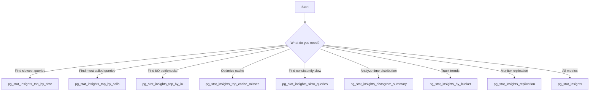

# Views Reference

Complete reference for all 20 pg_stat_insights views with examples and use cases including comprehensive replication monitoring and debugging.

---

## Overview

pg_stat_insights provides **20 pre-built views** for instant query performance analysis, replication monitoring, and diagnostics:

| View | Purpose | Typical Use Case |
|------|---------|------------------|
| `pg_stat_insights` | Main statistics view | All-purpose monitoring |
| `pg_stat_insights_top_by_time` | Slowest queries by total time | Find time-consuming queries |
| `pg_stat_insights_top_by_calls` | Most frequently called | Find hot path queries |
| `pg_stat_insights_top_by_io` | Highest I/O consumers | Identify disk-intensive operations |
| `pg_stat_insights_top_cache_misses` | Poor cache performers | Optimize buffer cache usage |
| `pg_stat_insights_slow_queries` | Queries with mean time >100ms | Find consistently slow queries |
| `pg_stat_insights_errors` | Queries with errors | Troubleshooting |
| `pg_stat_insights_plan_errors` | Plan estimation issues | Query optimization |
| `pg_stat_insights_histogram_summary` | Response time distribution | Performance analysis |
| `pg_stat_insights_by_bucket` | Time-series aggregation | Trend analysis |
| `pg_stat_insights_replication` | Basic replication monitoring | Basic replication lag tracking |
| `pg_stat_insights_physical_replication` | Physical replication details | Streaming replication health |
| `pg_stat_insights_logical_replication` | Logical replication slots | Logical replication lag tracking |
| `pg_stat_insights_replication_slots` | All replication slots | Slot health and WAL retention |
| `pg_stat_insights_replication_summary` | Replication overview | Cluster-wide replication status |
| `pg_stat_insights_replication_alerts` | Critical alerts | Lag/WAL loss/inactive detection |
| `pg_stat_insights_replication_wal` | WAL statistics | WAL retention and sizing |
| `pg_stat_insights_replication_bottlenecks` | Bottleneck detection | Network/I/O/replay analysis |
| `pg_stat_insights_replication_conflicts` | Conflict detection | Logical replication conflicts |
| `pg_stat_insights_replication_health` | Health diagnostics | Comprehensive health check |
| `pg_stat_insights_replication_performance` | Performance trends | Throughput and lag trends |
| `pg_stat_insights_replication_timeline` | Timeline analysis | Historical lag patterns |

---

## Main Views

### `pg_stat_insights`

**The primary statistics view with all 52 metrics**

```sql
SELECT * FROM pg_stat_insights LIMIT 10;
```

**Columns** (52 total):

| Category | Columns |
|----------|---------|
| **Identity** | userid, dbid, toplevel, queryid, query |
| **Planning** | plans, total_plan_time, min_plan_time, max_plan_time, mean_plan_time, stddev_plan_time |
| **Execution** | calls, total_exec_time, min_exec_time, max_exec_time, mean_exec_time, stddev_exec_time, rows |
| **Buffer I/O** | shared_blks_hit, shared_blks_read, shared_blks_dirtied, shared_blks_written |
| **Local I/O** | local_blks_hit, local_blks_read, local_blks_dirtied, local_blks_written |
| **Temp I/O** | temp_blks_read, temp_blks_written |
| **I/O Timing** | shared_blk_read_time, shared_blk_write_time, local_blk_read_time, local_blk_write_time, temp_blk_read_time, temp_blk_write_time |
| **WAL** | wal_records, wal_fpi, wal_bytes, wal_buffers_full |
| **JIT** | jit_functions, jit_generation_time, jit_inlining_count, jit_inlining_time, jit_optimization_count, jit_optimization_time, jit_emission_count, jit_emission_time, jit_deform_count, jit_deform_time |
| **Parallel** | parallel_workers_to_launch, parallel_workers_launched |
| **Timestamps** | stats_since, minmax_stats_since |

**Example:**

```sql
-- Comprehensive query analysis
SELECT 
    LEFT(query, 100) AS query_preview,
    calls,
    ROUND(mean_exec_time::numeric, 2) AS avg_time_ms,
    ROUND(cache_hit_ratio::numeric, 3) AS cache_ratio,
    pg_size_pretty(wal_bytes::bigint) AS wal_generated,
    parallel_workers_launched,
    rows
FROM pg_stat_insights
WHERE calls > 10
ORDER BY total_exec_time DESC
LIMIT 20;
```

---

## Performance Analysis Views

### `pg_stat_insights_top_by_time`

**Top 100 queries by total execution time**

Identifies queries consuming the most cumulative time.

```sql
SELECT * FROM pg_stat_insights_top_by_time LIMIT 10;
```

**Use Cases:**

- [TARGET] **Optimization priority** - Focus on queries consuming most time
- [DATA] **Capacity planning** - Identify resource-intensive operations
- [FIND] **Performance regression** - Detect newly slow queries

**Example Analysis:**

```sql
-- Find queries contributing to 80% of total time
WITH total_time AS (
    SELECT SUM(total_exec_time) AS total FROM pg_stat_insights
),
ranked AS (
    SELECT 
        query,
        total_exec_time,
        SUM(total_exec_time) OVER (ORDER BY total_exec_time DESC) AS running_total,
        ROW_NUMBER() OVER (ORDER BY total_exec_time DESC) AS rank
    FROM pg_stat_insights
)
SELECT 
    rank,
    LEFT(query, 100) AS query_preview,
    ROUND(total_exec_time::numeric, 2) AS time_ms,
    ROUND((running_total / (SELECT total FROM total_time) * 100)::numeric, 1) AS cumulative_pct
FROM ranked
WHERE running_total <= (SELECT total FROM total_time) * 0.8
ORDER BY rank;
```

---

### `pg_stat_insights_top_by_calls`

**Top 100 queries by call count**

Identifies most frequently executed queries.

```sql
SELECT * FROM pg_stat_insights_top_by_calls LIMIT 10;
```

**Use Cases:**

- [HOT] **Hot paths** - Identify critical code paths
- [FAST] **Caching opportunities** - Find queries to cache
- [TARGET] **Micro-optimization** - Even small improvements have big impact

**Example:**

```sql
-- Frequent queries with improvement potential
SELECT 
    LEFT(query, 100) AS query_preview,
    calls,
    ROUND(mean_exec_time::numeric, 2) AS avg_ms,
    ROUND((calls * mean_exec_time)::numeric, 2) AS total_time_ms,
    ROUND(cache_hit_ratio::numeric, 3) AS cache_ratio
FROM pg_stat_insights_top_by_calls
WHERE mean_exec_time > 1  -- Room for optimization
ORDER BY (calls * mean_exec_time) DESC
LIMIT 20;
```

---

### `pg_stat_insights_top_by_io`

**Top 100 queries by I/O operations**

Identifies disk-intensive queries.

```sql
SELECT * FROM pg_stat_insights_top_by_io LIMIT 10;
```

**Sorting Logic:**

```sql
ORDER BY (shared_blks_read + local_blks_read + temp_blks_read) DESC
```

**Use Cases:**

- [DISK] **Disk bottlenecks** - Find I/O-bound queries
- [DEPLOY] **Index opportunities** - Reduce sequential scans
- [TREND] **Storage planning** - Identify I/O patterns

**Example:**

```sql
-- I/O-intensive queries with timing
SELECT 
    LEFT(query, 100) AS query_preview,
    calls,
    shared_blks_read,
    shared_blks_hit,
    shared_blk_read_time,
    ROUND((shared_blk_read_time / NULLIF(shared_blks_read, 0))::numeric, 3) AS ms_per_block,
    ROUND(cache_hit_ratio::numeric, 3) AS cache_ratio
FROM pg_stat_insights_top_by_io
WHERE shared_blks_read > 0
LIMIT 20;
```

---

### `pg_stat_insights_top_cache_misses`

**Queries with poor cache performance**

Includes calculated `cache_hit_ratio` column.

```sql
SELECT * FROM pg_stat_insights_top_cache_misses LIMIT 10;
```

**Cache Hit Ratio Calculation:**

```sql
cache_hit_ratio = shared_blks_hit::numeric / 
                  NULLIF(shared_blks_hit + shared_blks_read, 0)
```

**Use Cases:**

- [DATA] **Cache optimization** - Improve buffer cache efficiency
- [TARGET] **Memory tuning** - Adjust `shared_buffers`
- [FIND] **Index analysis** - Find missing indexes

**Example:**

```sql
-- Queries needing cache optimization
SELECT 
    LEFT(query, 100) AS query_preview,
    calls,
    ROUND(cache_hit_ratio::numeric, 3) AS cache_ratio,
    shared_blks_hit,
    shared_blks_read,
    pg_size_pretty((shared_blks_read * 8192)::bigint) AS data_read_from_disk
FROM pg_stat_insights_top_cache_misses
WHERE cache_hit_ratio < 0.95 AND calls > 5
ORDER BY (shared_blks_read * calls) DESC
LIMIT 20;
```

---

### `pg_stat_insights_slow_queries`

**Queries with mean execution time > 100ms**

Filters for consistently slow queries.

```sql
SELECT * FROM pg_stat_insights_slow_queries;
```

**Filter Logic:**

```sql
WHERE mean_exec_time > 100
ORDER BY mean_exec_time DESC
```

**Use Cases:**

- [SLOW] **Slow query detection** - Find performance problems
- [TREND] **Optimization candidates** - Prioritize improvements
- [WARNING] **Performance alerts** - Set up monitoring thresholds

**Example:**

```sql
-- Slow queries with full context
SELECT 
    LEFT(query, 100) AS query_preview,
    calls,
    ROUND(min_exec_time::numeric, 2) AS min_ms,
    ROUND(mean_exec_time::numeric, 2) AS avg_ms,
    ROUND(max_exec_time::numeric, 2) AS max_ms,
    ROUND(stddev_exec_time::numeric, 2) AS stddev_ms,
    rows,
    ROUND(cache_hit_ratio::numeric, 3) AS cache_ratio
FROM pg_stat_insights_slow_queries
ORDER BY mean_exec_time DESC
LIMIT 20;
```

---

### `pg_stat_insights_histogram_summary`

**Response time distribution histogram**

Shows query count distribution across time buckets.

```sql
SELECT * FROM pg_stat_insights_histogram_summary
ORDER BY bucket_order;
```

**Columns:**

- `bucket_label` - Time range label (e.g., "< 1ms", "1-10ms")
- `bucket_order` - Ordering number
- `query_count` - Queries in this bucket
- `total_time` - Total execution time for bucket
- `avg_time` - Average execution time

**Use Cases:**

- [DATA] **Performance profile** - Understand query time distribution
- [TARGET] **SLA monitoring** - Track % of queries under threshold
- [TREND] **Trend analysis** - Monitor distribution changes

**Example:**

```sql
-- Response time SLA analysis
SELECT 
    bucket_label,
    query_count,
    ROUND((query_count::numeric / SUM(query_count) OVER () * 100), 1) AS pct_queries,
    ROUND(total_time::numeric, 2) AS total_ms,
    ROUND((total_time / SUM(total_time) OVER () * 100), 1) AS pct_time
FROM pg_stat_insights_histogram_summary
ORDER BY bucket_order;
```

**Sample Output:**

```
  bucket_label  | query_count | pct_queries | total_ms | pct_time
----------------+-------------+-------------+----------+----------
 < 1ms          |       1,234 |        82.3 | 456.12   |     15.2
 1-10ms         |         189 |        12.6 | 987.45   |     32.9
 10-100ms       |          52 |         3.5 | 1245.67  |     41.5
 100ms-1s       |          18 |         1.2 | 234.56   |      7.8
 > 1s           |           7 |         0.5 | 78.90    |      2.6
```

---

### `pg_stat_insights_by_bucket`

**Time-series query statistics by time bucket**

Groups queries by time periods for trend analysis.

```sql
SELECT * FROM pg_stat_insights_by_bucket
ORDER BY bucket_start DESC
LIMIT 24;
```

**Columns:**

- `bucket_start` - Bucket start timestamp
- `bucket_end` - Bucket end timestamp
- `query_count` - Distinct queries in bucket
- `total_calls` - Total executions
- `total_time` - Total execution time
- `avg_time` - Average execution time

**Use Cases:**

- [TIME] **Time-series analysis** - Track performance over time
- [FIND] **Pattern detection** - Find daily/hourly patterns
- [SCHEDULE] **Peak load analysis** - Identify busy periods

**Example:**

```sql
-- Hourly performance trends
SELECT 
    DATE_TRUNC('hour', bucket_start) AS hour,
    COUNT(*) AS bucket_count,
    SUM(query_count) AS total_queries,
    SUM(total_calls) AS total_executions,
    ROUND(AVG(avg_time)::numeric, 2) AS avg_response_ms
FROM pg_stat_insights_by_bucket
WHERE bucket_start >= NOW() - INTERVAL '24 hours'
GROUP BY DATE_TRUNC('hour', bucket_start)
ORDER BY hour DESC;
```

---

## Specialized Views

### `pg_stat_insights_errors`

**Queries that encountered errors**

!!! info "Note"
    This view may be empty if queries complete successfully. Errors are typically logged but not retained in statistics.

```sql
SELECT * FROM pg_stat_insights_errors;
```

**Use Cases:**

- [BUG] **Error detection** - Find failing queries
- [FIND] **Debugging** - Identify problematic SQL
- [WARNING] **Alert generation** - Monitor for errors

---

### `pg_stat_insights_plan_errors`

**Queries with significant plan estimation errors**

Compares planned rows vs actual rows.

```sql
SELECT * FROM pg_stat_insights_plan_errors;
```

**Use Cases:**

- [DATA] **Statistics accuracy** - Find stale statistics
- [TARGET] **Query tuning** - Identify mis-estimated queries
- [TREND] **Index effectiveness** - Evaluate index usage

**Example:**

```sql
-- Find queries with poor estimates
SELECT 
    LEFT(query, 100) AS query_preview,
    calls,
    rows AS actual_rows,
    planned_rows,
    ABS(rows - planned_rows) AS estimation_error,
    ROUND((ABS(rows - planned_rows)::numeric / NULLIF(GREATEST(rows, planned_rows), 0) * 100), 1) AS error_pct
FROM pg_stat_insights_plan_errors
WHERE ABS(rows - planned_rows) > 100
ORDER BY ABS(rows - planned_rows) DESC
LIMIT 20;
```

---

### `pg_stat_insights_replication`

**Replication lag and statistics monitoring**

```sql
SELECT * FROM pg_stat_insights_replication;
```

**Columns:**

- `pid` - Replication process ID
- `usename` - Replication user
- `application_name` - Client application
- `client_addr` - Client IP address
- `repl_state` - Replication state (streaming, catchup, etc.)
- `sync_state` - Synchronous state (sync, async, potential)
- `sent_lsn` - Last LSN sent to client
- `write_lag_bytes` - Bytes behind in writing
- `flush_lag_bytes` - Bytes behind in flushing
- `replay_lag_bytes` - Bytes behind in replaying
- `write_lag_seconds` - Time lag in writing
- `flush_lag_seconds` - Time lag in flushing
- `replay_lag_seconds` - Time lag in replaying

**Use Cases:**

- [SYNC] **Replication monitoring** - Track replica lag
- [WARNING] **Lag alerts** - Detect replication delays
- [DATA] **Capacity planning** - Understand replication load

**Example:**

```sql
-- Monitor replication lag
SELECT 
    application_name,
    client_addr,
    sync_state,
    pg_size_pretty(replay_lag_bytes::bigint) AS replay_lag_size,
    ROUND(replay_lag_seconds::numeric, 2) AS replay_lag_sec,
    CASE 
        WHEN replay_lag_seconds < 1 THEN '[OK] Healthy'
        WHEN replay_lag_seconds < 10 THEN '[WARNING] Warning'
        ELSE '[CRITICAL] Critical'
    END AS status
FROM pg_stat_insights_replication
ORDER BY replay_lag_seconds DESC;
```

---

## View Comparison

### When to Use Each View



### View Performance Characteristics

| View | Rows Returned | Query Speed | Memory Usage |
|------|---------------|-------------|--------------|
| `pg_stat_insights` | All queries (5,000+) | Medium | High |
| `pg_stat_insights_top_by_time` | 100 | Fast | Low |
| `pg_stat_insights_top_by_calls` | 100 | Fast | Low |
| `pg_stat_insights_top_by_io` | 100 | Fast | Low |
| `pg_stat_insights_top_cache_misses` | 100 | Fast | Low |
| `pg_stat_insights_slow_queries` | Filtered | Fast | Low |
| `pg_stat_insights_histogram_summary` | 10-20 | Very Fast | Very Low |
| `pg_stat_insights_by_bucket` | 100-1000 | Medium | Medium |
| `pg_stat_insights_replication` | 1-10 | Very Fast | Very Low |

---

## Advanced Usage

### Combining Views

```sql
-- Slow queries with poor cache performance
SELECT 
    s.query,
    s.mean_exec_time,
    c.cache_hit_ratio,
    s.calls,
    i.shared_blks_read
FROM pg_stat_insights_slow_queries s
JOIN pg_stat_insights_top_cache_misses c USING (queryid)
JOIN pg_stat_insights_top_by_io i USING (queryid)
WHERE c.cache_hit_ratio < 0.9
ORDER BY s.mean_exec_time DESC
LIMIT 15;
```

### Custom Views

```sql
-- Create your own monitoring view
CREATE VIEW my_critical_queries AS
SELECT 
    queryid,
    LEFT(query, 200) AS query_preview,
    calls,
    ROUND(mean_exec_time::numeric, 2) AS avg_ms,
    ROUND(cache_hit_ratio::numeric, 3) AS cache_ratio,
    pg_size_pretty(wal_bytes::bigint) AS wal_size,
    CASE 
        WHEN mean_exec_time > 1000 THEN '[CRITICAL] Critical'
        WHEN mean_exec_time > 100 THEN '[WARNING] Warning'
        ELSE '[OK] OK'
    END AS status
FROM pg_stat_insights
WHERE calls > 10 AND (
    mean_exec_time > 100 
    OR cache_hit_ratio < 0.9
    OR wal_bytes > 1000000
)
ORDER BY mean_exec_time DESC;

-- Query your custom view
SELECT * FROM my_critical_queries;
```

---

## View Maintenance

### Refresh Statistics

Statistics are continuously updated. To see latest data:

```sql
-- No special refresh needed - data is live
SELECT * FROM pg_stat_insights_top_by_time LIMIT 10;
```

### Reset Statistics

```sql
-- Reset all statistics (affects all views)
SELECT pg_stat_insights_reset();

-- Reset specific query
SELECT pg_stat_insights_reset(userid, dbid, queryid);
```

---

## Performance Considerations

### View Query Cost

All views are lightweight and query shared memory directly:

- **Cost**: ~1-10ms per query
- **Impact**: Minimal on production
- **Caching**: Results can be cached by application

### Best Practices

1. **Limit results** - Use `LIMIT` for large result sets
2. **Filter early** - Add WHERE clauses when possible
3. **Cache results** - Cache view results in application
4. **Avoid SELECT *** - Select only needed columns
5. **Use prepared statements** - For repeated view queries

---

## Next Steps

- **[Metrics Guide](metrics.md)** - Learn about all 52 metrics
- **[Usage Examples](usage.md)** - 50+ real-world queries
- **[Quick Start](quick-start.md)** - Start monitoring now


---

## Replication Monitoring Views

### `pg_stat_insights_physical_replication`

**Enhanced physical replication monitoring with health status**

```sql
SELECT * FROM pg_stat_insights_physical_replication;
```

**Columns:**

- `pid` - Backend process ID
- `usename` - Replication user name
- `application_name` - Application identifier
- `client_addr` - Client IP address
- `client_hostname` - Client hostname
- `client_port` - Client port number
- `backend_start` - Time when this process was started
- `uptime_seconds` - How long replica has been connected
- `backend_xmin` - Transaction ID threshold
- `repl_state` - Current state (streaming, catchup, backup)
- `sync_state` - Synchronous commit state (async, potential, quorum, sync)
- `sync_priority` - Priority for synchronous replication
- `sent_lsn` - Last WAL location sent to replica
- `write_lsn` - Last WAL location written by replica
- `flush_lsn` - Last WAL location flushed by replica
- `replay_lsn` - Last WAL location replayed by replica
- `write_lag_bytes` - Bytes between sent and write
- `flush_lag_bytes` - Bytes between sent and flush
- `replay_lag_bytes` - Bytes between sent and replay
- `write_lag_mb` - MB lag for write
- `flush_lag_mb` - MB lag for flush
- `replay_lag_mb` - MB lag for replay
- `write_lag_seconds` - Time lag for write
- `flush_lag_seconds` - Time lag for flush
- `replay_lag_seconds` - Time lag for replay
- `reply_time` - Last status update from replica
- `last_msg_age_seconds` - Seconds since last message
- `health_status` - HEALTHY, WARNING, CRITICAL, SYNCING, DISCONNECTED

**Example: Monitor replica health**

```sql
SELECT 
    application_name,
    client_addr,
    replay_lag_mb,
    replay_lag_seconds,
    health_status
FROM pg_stat_insights_physical_replication
ORDER BY replay_lag_seconds DESC NULLS LAST;
```

### `pg_stat_insights_logical_replication`

**Logical replication slot monitoring with lag tracking**

```sql
SELECT * FROM pg_stat_insights_logical_replication;
```

**Columns:**

- `slot_name` - Replication slot identifier
- `plugin` - Logical decoding plugin (pgoutput, wal2json, etc.)
- `slot_type` - Always 'logical'
- `database` - Database name
- `active` - Whether slot is actively being used
- `active_pid` - PID of process using the slot
- `xmin` - Oldest transaction that slot prevents from being vacuumed
- `catalog_xmin` - Oldest transaction affecting system catalogs
- `restart_lsn` - WAL position slot needs to restart from
- `confirmed_flush_lsn` - WAL position confirmed by subscriber
- `wal_status` - WAL availability status (reserved, extended, unreserved, lost)
- `safe_wal_size` - Bytes until wal_keep_size limit
- `two_phase` - Whether slot supports two-phase commit
- `lag_bytes` - Bytes of WAL lag
- `lag_mb` - MB of WAL lag
- `wal_files_retained` - Number of WAL segment files retained

**Example: Monitor logical replication lag**

```sql
SELECT 
    slot_name,
    database,
    plugin,
    active,
    lag_mb,
    wal_files_retained,
    wal_status
FROM pg_stat_insights_logical_replication
ORDER BY lag_mb DESC;
```

### `pg_stat_insights_replication_slots`

**All replication slots (physical + logical) with health monitoring**

```sql
SELECT * FROM pg_stat_insights_replication_slots;
```

**Columns:**

- All standard pg_replication_slots columns
- `lag_bytes` - Total lag in bytes
- `lag_mb` - Total lag in megabytes
- `wal_files_retained` - WAL segments being retained
- `health_status` - HEALTHY, INACTIVE, WARNING, CRITICAL, HIGH_LAG

**Example: Identify problematic slots**

```sql
SELECT 
    slot_name,
    slot_type,
    database,
    active,
    health_status,
    lag_mb,
    wal_status
FROM pg_stat_insights_replication_slots
WHERE health_status IN ('CRITICAL', 'WARNING', 'HIGH_LAG')
ORDER BY lag_mb DESC;
```

### `pg_stat_insights_replication_summary`

**Cluster-wide replication overview**

```sql
SELECT * FROM pg_stat_insights_replication_summary;
```

**Columns:**

- `physical_replicas_connected` - Number of streaming replicas
- `physical_slots_active` - Active physical replication slots
- `logical_slots_active` - Active logical replication slots
- `inactive_slots` - Slots not currently in use
- `slots_with_lost_wal` - Slots that lost required WAL
- `max_replay_lag_bytes` - Maximum replay lag across all replicas
- `max_replay_lag_seconds` - Maximum replay lag in seconds
- `avg_replay_lag_seconds` - Average replay lag in seconds
- `current_wal_lsn` - Current WAL write position
- `total_slot_lag_bytes` - Combined lag of all slots
- `streaming_replicas` - Replicas in streaming state
- `catchup_replicas` - Replicas catching up
- `sync_replicas` - Synchronous replicas
- `potential_sync_replicas` - Potential sync candidates

**Example: Get cluster replication overview**

```sql
SELECT 
    physical_replicas_connected,
    logical_slots_active,
    max_replay_lag_seconds,
    streaming_replicas,
    sync_replicas,
    ROUND((max_replay_lag_bytes::numeric / 1024 / 1024), 2) AS max_lag_mb
FROM pg_stat_insights_replication_summary;
```


### `pg_stat_insights_replication_alerts`

**Critical alert detection for replication issues**

```sql
SELECT * FROM pg_stat_insights_replication_alerts
WHERE alert_level LIKE 'CRITICAL%' OR alert_level LIKE 'WARNING%';
```

**Columns:**

- `replication_type` - PHYSICAL or LOGICAL
- `identifier` - application_name (physical) or slot_name (logical)
- `source` - client_addr (physical) or database (logical)
- `alert_level` - OK, INFO, WARNING, CRITICAL with description
- `lag_seconds` - Time lag (physical only)
- `lag_mb` - Space lag in megabytes
- `state` - Current replication state
- `sync_state` - Synchronization state or plugin name
- `last_message_age_seconds` - Seconds since last message (physical only)

**Alert Thresholds:**

Physical Replication:
- CRITICAL: Not streaming or lag > 5 minutes
- WARNING: Lag > 1 minute
- INFO: Lag > 10 seconds

Logical Replication:
- CRITICAL: WAL lost or lag > 1GB
- WARNING: Inactive or WAL unreserved or lag > 100MB

**Example: Get all critical alerts**

```sql
SELECT 
    replication_type,
    identifier,
    alert_level,
    lag_mb,
    state
FROM pg_stat_insights_replication_alerts
WHERE alert_level NOT LIKE 'OK%'
ORDER BY 
    CASE 
        WHEN alert_level LIKE 'CRITICAL%' THEN 1
        WHEN alert_level LIKE 'WARNING%' THEN 2
        ELSE 3
    END,
    lag_mb DESC NULLS LAST;
```

### `pg_stat_insights_replication_wal`

**Detailed WAL statistics and retention analysis**

```sql
SELECT * FROM pg_stat_insights_replication_wal;
```

**Columns:**

- `current_wal_lsn` - Current WAL write position
- `current_wal_insert_lsn` - Current WAL insert position
- `total_wal_generated_bytes` - Total WAL generated since cluster init
- `total_wal_generated_gb` - Total WAL in gigabytes
- `wal_files_count` - Number of WAL segment files
- `wal_total_size_bytes` - Total size of all WAL files
- `wal_total_size_mb` - Total WAL size in megabytes
- `wal_keep_size` - wal_keep_size setting
- `max_wal_size` - max_wal_size setting
- `min_wal_size` - min_wal_size setting
- `oldest_slot_lsn` - Oldest LSN required by any slot
- `wal_retained_mb` - WAL retained for replication slots

**Example: Check WAL retention**

```sql
SELECT 
    wal_files_count,
    wal_total_size_mb,
    wal_retained_mb,
    wal_keep_size,
    CASE
        WHEN wal_retained_mb::numeric > wal_keep_size::numeric THEN 'WARNING: Exceeding wal_keep_size'
        WHEN wal_total_size_mb > 10000 THEN 'WARNING: WAL directory > 10GB'
        ELSE 'OK'
    END AS status
FROM pg_stat_insights_replication_wal;
```

### `pg_stat_insights_replication_bottlenecks`

**Identify replication bottlenecks (network, I/O, or replay)**

```sql
SELECT * FROM pg_stat_insights_replication_bottlenecks;
```

**Columns:**

- `application_name` - Replica identifier
- `client_addr` - Replica address
- `state` - Replication state
- `sync_state` - Synchronization state
- `bottleneck_type` - Type of bottleneck detected or "No bottleneck detected"
- `write_lag_bytes`, `flush_lag_bytes`, `replay_lag_bytes` - Lag at each stage
- `write_lag_sec`, `flush_lag_sec`, `replay_lag_sec` - Time lag at each stage
- `last_msg_age_sec` - Seconds since last heartbeat
- `backend_xmin` - Transaction horizon
- `connection_age_sec` - Connection duration

**Bottleneck Types:**

- **Network bottleneck** - Slow write phase (network transfer)
- **Disk I/O bottleneck** - Slow flush phase (disk writes)
- **Replay bottleneck** - Slow apply phase (query execution on replica)
- **High lag** - General lag without specific bottleneck
- **Not streaming** - Connection or configuration issue

**Example: Diagnose replication bottlenecks**

```sql
SELECT 
    application_name,
    bottleneck_type,
    write_lag_sec,
    flush_lag_sec,
    replay_lag_sec,
    ROUND((write_lag_bytes::numeric / 1024 / 1024), 2) AS write_lag_mb,
    ROUND((flush_lag_bytes::numeric / 1024 / 1024), 2) AS flush_lag_mb,
    ROUND((replay_lag_bytes::numeric / 1024 / 1024), 2) AS replay_lag_mb
FROM pg_stat_insights_replication_bottlenecks
WHERE bottleneck_type != 'No bottleneck detected';
```

### `pg_stat_insights_replication_conflicts`

**Logical replication conflict and WAL status monitoring**

```sql
SELECT * FROM pg_stat_insights_replication_conflicts;
```

**Columns:**

- `slot_name` - Logical slot identifier
- `database` - Target database
- `plugin` - Decoding plugin
- `conflicting` - Has unresolved conflicts
- `wal_status` - WAL availability (reserved, lost, unreserved)
- `conflict_status` - Human-readable status with severity
- `active` - Slot currently in use
- `xmin`, `catalog_xmin` - Transaction horizons
- `lag_bytes`, `lag_mb` - Current lag
- `safe_wal_size` - Bytes until WAL limit
- `wal_safety_status` - WAL safety assessment
- `wal_files_held` - Number of WAL segments retained

**Example: Find slots with conflicts or WAL issues**

```sql
SELECT 
    slot_name,
    database,
    conflict_status,
    wal_safety_status,
    lag_mb,
    wal_files_held,
    active
FROM pg_stat_insights_replication_conflicts
WHERE conflict_status != 'OK' OR wal_safety_status != 'OK'
ORDER BY 
    CASE conflict_status 
        WHEN 'CRITICAL: Required WAL segments lost' THEN 1
        WHEN 'CRITICAL: Exceeding wal_keep_size' THEN 2
        ELSE 3
    END;
```

### `pg_stat_insights_replication_health`

**Comprehensive health check with actionable recommendations**

```sql
SELECT * FROM pg_stat_insights_replication_health;
```

**Columns:**

- `slot_name` - Replication slot name
- `slot_type` - physical or logical
- `database` - Database name
- `plugin` - Logical decoding plugin (if logical)
- `active`, `temporary` - Slot status flags
- `wal_status` - WAL segment status
- `overall_health` - OK, WARNING, CRITICAL
- `issues` - Array of detected issues
- `lag_bytes`, `lag_mb` - Current lag metrics
- `wal_files_held` - WAL segments retained
- `safe_wal_size`, `safe_wal_size_mb` - Safe WAL space remaining
- `recommendation` - Actionable advice for fixing issues

**Example: Get health report with recommendations**

```sql
SELECT 
    slot_name,
    slot_type,
    overall_health,
    lag_mb,
    wal_files_held,
    issues,
    recommendation
FROM pg_stat_insights_replication_health
WHERE overall_health != 'OK'
ORDER BY 
    CASE overall_health 
        WHEN 'CRITICAL' THEN 1
        WHEN 'WARNING' THEN 2
        ELSE 3
    END;
```

### `pg_stat_insights_replication_performance`

**Performance trends and replay throughput analysis**

```sql
SELECT * FROM pg_stat_insights_replication_performance;
```

**Columns:**

- `application_name`, `client_addr` - Replica identification
- `state`, `sync_state` - Replication status
- `sent_lsn`, `replay_lsn` - WAL positions
- `current_lag_bytes`, `current_lag_mb`, `current_lag_seconds` - Current lag metrics
- `uptime_seconds` - Connection duration
- `avg_lag_bytes_per_second` - Average lag accumulation rate
- `replay_rate_bytes_per_second` - Replay throughput
- `replay_rate_mb_per_second` - Replay throughput in MB/s
- `performance_rating` - Excellent, Good, Fair, Poor, Critical

**Performance Ratings:**

- **Excellent** - Lag < 1 second
- **Good** - Lag < 5 seconds
- **Fair** - Lag < 30 seconds
- **Poor** - Lag < 5 minutes
- **Critical** - Lag > 5 minutes

**Example: Analyze replication performance**

```sql
SELECT 
    application_name,
    performance_rating,
    current_lag_seconds,
    replay_rate_mb_per_second,
    avg_lag_bytes_per_second,
    ROUND((uptime_seconds::numeric / 3600), 1) AS uptime_hours
FROM pg_stat_insights_replication_performance
ORDER BY current_lag_seconds DESC;
```

### `pg_stat_insights_replication_timeline`

**Historical timeline analysis with lag trends**

```sql
SELECT * FROM pg_stat_insights_replication_timeline;
```

**Columns:**

- `application_name`, `client_addr` - Replica identification
- `backend_start` - When connection started
- `connected_for_seconds`, `connected_for_hours` - Connection duration
- `sent_lsn`, `replay_lsn` - WAL positions
- `replay_lag_bytes`, `replay_lag_mb`, `replay_lag_seconds` - Current lag
- `avg_lag_mb_per_hour` - Average lag accumulation rate
- `replay_throughput_kb_per_sec` - Replay speed
- `reply_time` - Last heartbeat time
- `heartbeat_age_seconds` - Time since last heartbeat
- `status_message` - Human-readable status with severity

**Example: Identify lagging replicas over time**

```sql
SELECT 
    application_name,
    connected_for_hours,
    replay_lag_seconds,
    avg_lag_mb_per_hour,
    replay_throughput_kb_per_sec,
    status_message
FROM pg_stat_insights_replication_timeline
ORDER BY replay_lag_seconds DESC;
```

---

## Replication Monitoring Quick Reference

**Quick diagnostics for common scenarios:**

```sql
-- Check overall cluster replication health
SELECT * FROM pg_stat_insights_replication_summary;

-- Find all current alerts
SELECT * FROM pg_stat_insights_replication_alerts
WHERE alert_level != 'OK';

-- Identify bottlenecks
SELECT application_name, bottleneck_type
FROM pg_stat_insights_replication_bottlenecks
WHERE bottleneck_type != 'No bottleneck detected';

-- Check logical replication conflicts
SELECT slot_name, conflict_status, lag_mb
FROM pg_stat_insights_replication_conflicts
WHERE conflict_status != 'OK';

-- Get health recommendations
SELECT slot_name, overall_health, recommendation
FROM pg_stat_insights_replication_health
WHERE recommendation IS NOT NULL;

-- Monitor performance trends
SELECT application_name, performance_rating, replay_rate_mb_per_second
FROM pg_stat_insights_replication_performance;

-- Analyze WAL retention
SELECT wal_files_count, wal_total_size_mb, wal_retained_mb
FROM pg_stat_insights_replication_wal;
```

